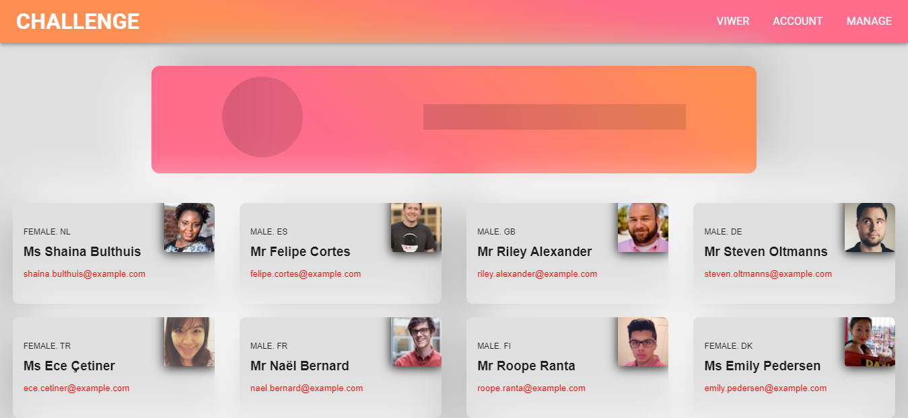
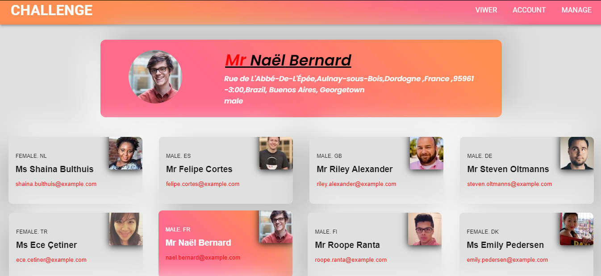

## **KAWA SPACE Assignment**
<hr>

**Card Selecting React App created with React.js**
<br>
<br>

### Table Of Content
<hr>

* General Info
* Technologies
* Setup


### General Info 
<hr>
 This is a Card Selecting react app where  data is fetched from the  API into the card.
 <br>
<br>

### Before Card Select
# 


### After Card Select
# 

 ### Technologies
 <hr>
 This project is created with :

 * React.js
 * Axios 
 * Material-ui

### Setup
```
npm install
```
This will help to install all the dependencies of the project.

